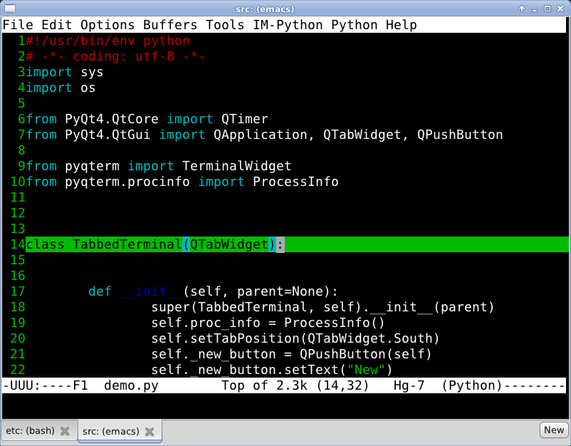

.. PyQTermWidget documentation master file, created by
   sphinx-quickstart on Wed Oct 12 09:49:10 2011.
   You can adapt this file completely to your liking, but it should at least
   contain the root `toctree` directive.

Welcome to Py3QTermWidget's documentation!
=========================================

Unlike the older pyqonsole this console widget works with PyQt5/Pyside2 and let's you
embed a shell into your application. 

The vt100 terminal emulation code is based on AjaxTerm and WebShell.
All code is distributed under the General Public License 3.

Contents:

.. toctree::
   :maxdepth: 2
   
   usage
   todo

How to get it
-------------

The latest snapshot is available at::
  
  https://gitlab.com/mikeramsey/py3qtermwidget

To clone the git repository do::

  git clone https://gitlab.com/mikeramsey/py3qtermwidget

Or just got to the Gitlab overview page: https://gitlab.com/mikeramsey/py3qtermwidget

The Python Packaging Index (PyPI) also contains releases:  http://pypi.python.org/pypi/pyqterm

The generated HTML-documentation is hosted at http://pyqtermwidget.rtfd.org/
(PDF: http://media.readthedocs.org/pdf/pyqtermwidget/latest/pyqtermwidget.pdf).
   
   
Indices and tables
==================

* :ref:`genindex`
* :ref:`modindex`
* :ref:`search`

